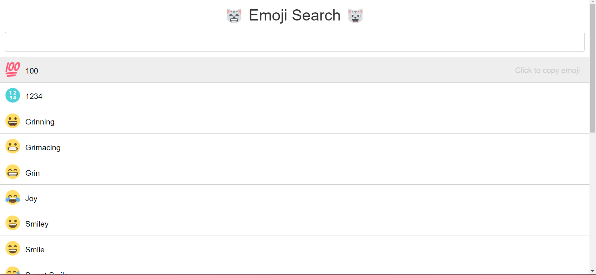
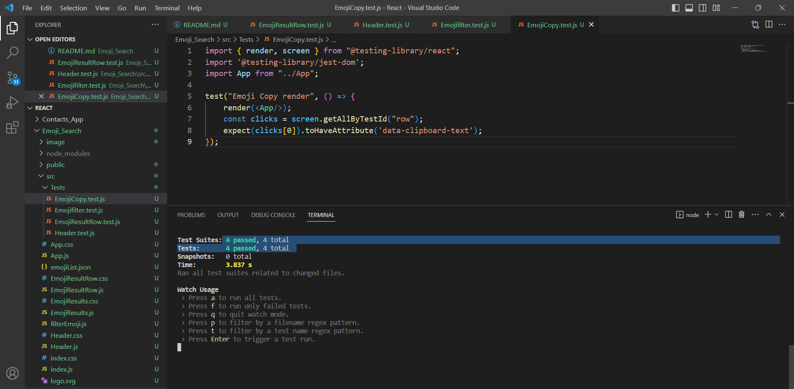

# React Testing Library

`Patika.dev - Kodluyoruz React Testing eğitimi kapsamında yapılan React test çalışmasıdır! `

#### Gereksinimler :

- Başlık kısmının başarılı bir şekilde render edildiğini kontrol edecek olan test kodunu yazın.
- Uygulama ilk açıldığında emoji listesinin başarılı bir şekilde render edildiğini kontrol edecek olan test kodunu yazın.
- Bir filtreleme işlemi yapıldığında, emoji listesinin bu filtreye uygun şekilde yeniden render edildiğini kontrol edecek olan test kodunu yazın.
- Liste üzerinden herhangi emojiye tıklandığında, ilgili emojinin kopyalandığını kontrol edecek olan test kodunu yazın.

 

 

