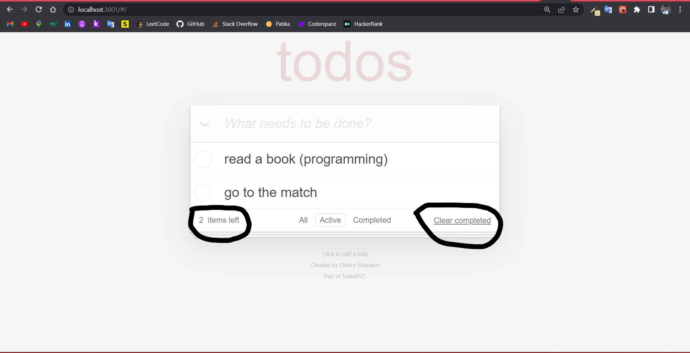

# To Do List with React

- First, we run the `npx create-react-app` command in the directory where we will work.

- Then we run our project with `npm start`

## About the App

- The purpose of this application; React was made to learn and reinforce.

- After adding our tasks to the To do list :

  - `All : `

    

  - `Active : `

    

  - `Completed : `

    

  - `some fine details : `

    

    
